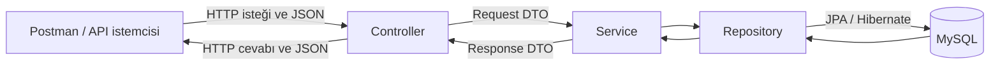
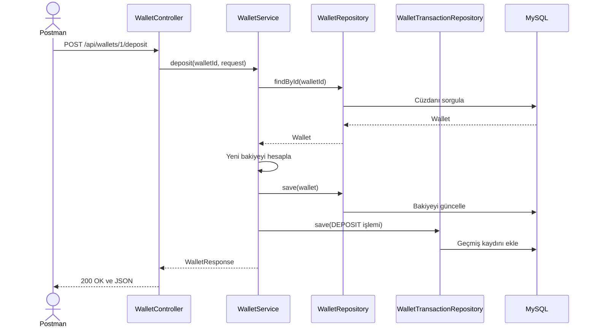
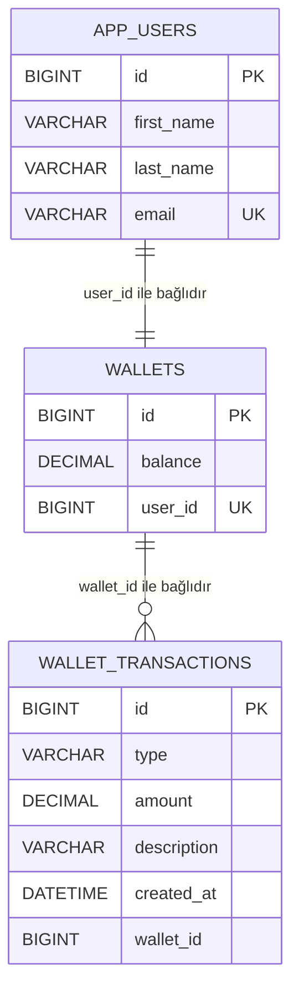

# MiniWallet API

Spring Boot ile geliştirilen, temel dijital cüzdan işlemlerini yöneten hafif bir REST API projesidir.

MiniWallet; kullanıcı oluşturma, kullanıcıya otomatik cüzdan açma, cüzdana para ekleme, para harcama, bakiye görüntüleme ve işlem geçmişini listeleme özelliklerini içerir. Proje; Spring Boot'un temel konularını gerçek bir iş kuralı üzerinden öğrenmek amacıyla geliştirilmiştir.

> Bu proje eğitim ve portföy amacıyla geliştirilmektedir. Gerçek bir banka veya ödeme kuruluşu uygulaması değildir.

## İçindekiler

- [Projenin amacı](#projenin-amacı)
- [Özellikler](#özellikler)
- [Kullanılan teknolojiler](#kullanılan-teknolojiler)
- [Mimari](#mimari)
- [Proje yapısı](#proje-yapısı)
- [Veritabanı modeli](#veritabanı-modeli)
- [API endpointleri](#api-endpointleri)
- [İstek ve cevap örnekleri](#istek-ve-cevap-örnekleri)
- [İş kuralları](#iş-kuralları)
- [Hata yönetimi](#hata-yönetimi)
- [Projeyi çalıştırma](#projeyi-çalıştırma)
- [Postman ile test](#postman-ile-test)
- [Öğrenilen Spring konuları](#öğrenilen-spring-konuları)
- [Gelecekte eklenebilecekler](#gelecekte-eklenebilecekler)

## Projenin amacı

Bu projenin amacı yalnızca CRUD işlemleri yapmak değildir. Kullanıcı ve cüzdan verilerini yönetirken aşağıdaki gerçek iş kurallarını da uygulamaktır:

- Her kullanıcı oluşturulduğunda kullanıcıya sıfır bakiyeli bir cüzdan açılır.
- Cüzdana yalnızca sıfırdan büyük tutarda para eklenebilir.
- Cüzdandan yalnızca sıfırdan büyük tutarda para harcanabilir.
- Cüzdan bakiyesinden daha büyük bir tutar harcanamaz.
- Başarılı para ekleme ve harcama işlemleri geçmişe kaydedilir.
- İşlem geçmişi en yeni işlemden en eski işleme doğru listelenir.

## Özellikler

- Kullanıcı oluşturma
- Kullanıcı bilgilerini ID ile görüntüleme
- Kullanıcı oluşturulurken otomatik cüzdan açma
- Cüzdan bakiyesini görüntüleme
- Cüzdana para ekleme
- Cüzdandan para harcama
- Yetersiz bakiye kontrolü
- Para ekleme ve harcama geçmişini görüntüleme
- DTO kullanımı
- İstek doğrulama
- Merkezi hata yönetimi
- Veritabanı işlemlerinde transaction yönetimi

### İlk sürümde bulunmayan özellikler

Projenin öğrenme amacıyla sade kalması için ilk sürümde aşağıdaki özellikler bulunmamaktadır:

- JWT ve kullanıcı girişi
- Spring Security
- Admin paneli
- Kullanıcılar arası para transferi
- React veya başka bir frontend arayüzü
- Redis ve rate limiting
- E-posta gönderimi
- Kafka ve mikroservis mimarisi
- Karmaşık bankacılık kuralları

## Kullanılan teknolojiler

| Teknoloji | Kullanım amacı |
|---|---|
| Java 21 | Uygulamanın programlama dili |
| Spring Boot 4.1.0 | Uygulamayı ve Spring bileşenlerini çalıştırmak |
| Spring Web MVC | REST endpointlerini oluşturmak |
| Spring Data JPA | Veritabanı işlemlerini yönetmek |
| Hibernate | Entity sınıflarını MySQL tablolarıyla eşleştirmek |
| Jakarta Validation | Gelen istekleri doğrulamak |
| MySQL 8.4 | Uygulama verilerini saklamak |
| Maven | Bağımlılık ve proje yönetimi |
| Docker Desktop | MySQL'i container içerisinde çalıştırmak |
| MySQL Workbench | Veritabanını görsel olarak incelemek |
| Postman | API endpointlerini test etmek |
| IntelliJ IDEA Ultimate | Projeyi geliştirmek ve çalıştırmak |

## Mimari

Projede katmanlı mimari kullanılmaktadır. Her katmanın tek bir temel sorumluluğu vardır.



| Katman | Görevi |
|---|---|
| Controller | HTTP isteğini karşılar, URL ve JSON verilerini alır, Service katmanını çağırır. |
| DTO | API'ye gelen ve API'den dönen verinin şeklini belirler. |
| Service | İş kurallarını uygular ve işlemin hangi sırayla yapılacağını yönetir. |
| Repository | JPA aracılığıyla veritabanı işlemlerini gerçekleştirir. |
| Entity | Java nesneleriyle veritabanı tablolarını eşleştirir. |
| Exception | Beklenen hata durumlarını anlamlı sınıflarla temsil eder. |
| GlobalExceptionHandler | Hataları uygun HTTP durum kodu ve JSON cevabına dönüştürür. |

### Para ekleme isteğinin çalışma sırası



`@Transactional` sayesinde bakiye güncelleme ve işlem geçmişi kaydı tek bir bütün olarak ele alınır. İşlemlerden biri başarısız olursa veritabanında yarım kalmış bir sonuç oluşması engellenir.

## Proje yapısı

```text
src/main/java/com/onurerkoc/miniwallet
├── controller
│   ├── UserController.java
│   └── WalletController.java
├── dto
│   ├── ApiErrorResponse.java
│   ├── CreateUserRequest.java
│   ├── DepositRequest.java
│   ├── ExpenseRequest.java
│   ├── TransactionResponse.java
│   ├── UserResponse.java
│   └── WalletResponse.java
├── entity
│   ├── TransactionType.java
│   ├── User.java
│   ├── Wallet.java
│   └── WalletTransaction.java
├── exception
│   ├── EmailAlreadyExistsException.java
│   ├── GlobalExceptionHandler.java
│   ├── InsufficientBalanceException.java
│   ├── UserNotFoundException.java
│   └── WalletNotFoundException.java
├── repository
│   ├── UserRepository.java
│   ├── WalletRepository.java
│   └── WalletTransactionRepository.java
├── service
│   ├── UserService.java
│   └── WalletService.java
└── MiniwalletApplication.java
```

## Veritabanı modeli



> Projenin bu öğrenme sürümünde karmaşık JPA ilişki anotasyonları kullanılmamaktadır. `Wallet` sınıfında kullanıcı bağlantısı `Long userId`, `WalletTransaction` sınıfında cüzdan bağlantısı ise `Long walletId` alanıyla tutulmaktadır. Diyagramdaki çizgiler bu mantıksal bağlantıları gösterir.

### Tablolar

#### `app_users`

| Alan | Açıklama |
|---|---|
| `id` | Kullanıcının otomatik oluşturulan benzersiz kimliği |
| `first_name` | Kullanıcının adı |
| `last_name` | Kullanıcının soyadı |
| `email` | Kullanıcının benzersiz e-posta adresi |

#### `wallets`

| Alan | Açıklama |
|---|---|
| `id` | Cüzdanın otomatik oluşturulan benzersiz kimliği |
| `balance` | Cüzdanın güncel bakiyesi |
| `user_id` | Cüzdanın ait olduğu kullanıcının ID değeri |

#### `wallet_transactions`

| Alan | Açıklama |
|---|---|
| `id` | İşlem kaydının benzersiz kimliği |
| `type` | İşlem türü: `DEPOSIT` veya `EXPENSE` |
| `amount` | İşlem tutarı |
| `description` | İşlem açıklaması |
| `created_at` | İşlemin gerçekleştiği tarih ve saat |
| `wallet_id` | İşlemin ait olduğu cüzdanın ID değeri |

## API endpointleri

Temel adres:

```text
http://localhost:8080
```

| Metot | Endpoint | Açıklama | Başarılı durum |
|---|---|---|---|
| `POST` | `/api/users` | Yeni kullanıcı oluşturur ve otomatik cüzdan açar. | `201 Created` |
| `GET` | `/api/users/{userId}` | Kullanıcıyı ID ile getirir. | `200 OK` |
| `GET` | `/api/wallets/{walletId}` | Cüzdanı ve güncel bakiyeyi getirir. | `200 OK` |
| `POST` | `/api/wallets/{walletId}/deposit` | Cüzdana para ekler ve işlem kaydı oluşturur. | `200 OK` |
| `POST` | `/api/wallets/{walletId}/expense` | Cüzdandan para harcar ve işlem kaydı oluşturur. | `200 OK` |
| `GET` | `/api/wallets/{walletId}/transactions` | Cüzdanın işlem geçmişini en yeniden eskiye getirir. | `200 OK` |

## İstek ve cevap örnekleri

### Kullanıcı oluşturma

```http
POST /api/users
Content-Type: application/json
```

İstek:

```json
{
  "firstName": "Onur",
  "lastName": "Erkoç",
  "email": "onur@example.com"
}
```

`201 Created` cevabı:

```json
{
  "id": 1,
  "firstName": "Onur",
  "lastName": "Erkoç",
  "email": "onur@example.com"
}
```

Kullanıcı oluşturulduğunda başlangıç bakiyesi `0.00` olan bir cüzdan da otomatik olarak oluşturulur.

### Kullanıcı görüntüleme

```http
GET /api/users/1
```

`200 OK` cevabı:

```json
{
  "id": 1,
  "firstName": "Onur",
  "lastName": "Erkoç",
  "email": "onur@example.com"
}
```

### Cüzdan görüntüleme

```http
GET /api/wallets/1
```

`200 OK` cevabı:

```json
{
  "id": 1,
  "balance": 750.00,
  "userId": 1
}
```

### Para ekleme

```http
POST /api/wallets/1/deposit
Content-Type: application/json
```

İstek:

```json
{
  "amount": 1000,
  "description": "Aylık harçlık"
}
```

`200 OK` cevabı:

```json
{
  "id": 1,
  "balance": 1000.00,
  "userId": 1
}
```

### Para harcama

```http
POST /api/wallets/1/expense
Content-Type: application/json
```

İstek:

```json
{
  "amount": 250,
  "description": "Market alışverişi"
}
```

`200 OK` cevabı:

```json
{
  "id": 1,
  "balance": 750.00,
  "userId": 1
}
```

Bu işlemden sonra bakiye hesabı:

```text
1000 TL - 250 TL = 750 TL
```

### İşlem geçmişi

```http
GET /api/wallets/1/transactions
```

`200 OK` cevabı:

```json
[
  {
    "id": 2,
    "type": "EXPENSE",
    "amount": 250.00,
    "description": "Market alışverişi",
    "createdAt": "2026-08-01T11:10:00"
  },
  {
    "id": 1,
    "type": "DEPOSIT",
    "amount": 1000.00,
    "description": "Aylık harçlık",
    "createdAt": "2026-08-01T11:09:00"
  }
]
```

## İş kuralları

### Pozitif tutar kontrolü

Para ekleme ve harcama tutarı sıfırdan büyük olmalıdır. Bu kontrol DTO sınıflarındaki validation anotasyonlarıyla gerçekleştirilir.

```java
@NotNull
@Positive
private BigDecimal amount;
```

### Yetersiz bakiye kontrolü

Harcanmak istenen tutar mevcut bakiyeden büyükse işlem durdurulur.

```java
if (wallet.getBalance().compareTo(expenseAmount) < 0) {
    throw new InsufficientBalanceException("Yetersiz bakiye");
}
```

Para değerlerinde hassasiyet kaybı yaşamamak için `double` yerine `BigDecimal` kullanılmaktadır.

### Aynı e-posta kontrolü

Bir e-posta adresiyle yalnızca bir kullanıcı oluşturulabilir. Repository içerisindeki aşağıdaki metot Spring Data JPA tarafından metot isminden otomatik sorguya dönüştürülür:

```java
boolean existsByEmail(String email);
```

### İşlem türleri

```java
public enum TransactionType {
    DEPOSIT,
    EXPENSE
}
```

Enum değerleri veritabanında okunabilir metinler olarak saklanır.

## Hata yönetimi

Uygulamada oluşan beklenen hatalar `GlobalExceptionHandler` tarafından merkezi olarak yakalanır.

| Durum | HTTP kodu | Açıklama |
|---|---:|---|
| Başarılı veri getirme veya cüzdan işlemi | `200` | İstek başarıyla tamamlandı. |
| Kullanıcı oluşturma | `201` | Yeni kullanıcı başarıyla oluşturuldu. |
| Geçersiz veya eksik istek | `400` | Validation kurallarından biri sağlanmadı. |
| Kullanıcı veya cüzdan bulunamadı | `404` | İstenen kaynak veritabanında bulunamadı. |
| E-posta zaten kullanılıyor | `409` | Aynı e-posta adresiyle başka kullanıcı var. |
| Bakiye yetersiz | `409` | Harcama tutarı mevcut bakiyeden büyük. |

Örnek hata cevabı:

```json
{
  "message": "Yetersiz bakiye"
}
```

## Projeyi çalıştırma

### Gereksinimler

- IntelliJ IDEA Ultimate
- JDK 21
- Docker Desktop
- MySQL Workbench
- Postman
- Git

### 1. Projeyi klonlayın

```bash
git clone https://github.com/onurerkoc-dev/miniwallet.git
```

Projeyi IntelliJ IDEA ile açın ve Maven bağımlılıklarının yüklenmesini bekleyin.

### 2. MySQL container'ını Docker Desktop ile oluşturun

Docker Desktop üzerinden:

1. **Images** bölümünü açın.
2. `mysql:8.4` image'ını indirin.
3. Image yanındaki **Run** düğmesine basın.
4. Aşağıdaki ayarları girin.

| Ayar | Değer |
|---|---|
| Container name | `miniwallet-mysql` |
| Host port | `3307` |
| Container port | `3306` |

Environment variables:

| Değişken | Örnek değer |
|---|---|
| `MYSQL_ROOT_PASSWORD` | Güçlü bir root parolası |
| `MYSQL_DATABASE` | `miniwallet_db` |
| `MYSQL_USER` | `miniwallet_user` |
| `MYSQL_PASSWORD` | Güçlü bir kullanıcı parolası |

Verilerin container silindiğinde kaybolmaması için Docker volume veya bilgisayarda kalıcı bir klasör kullanılabilir. Container içindeki hedef klasör:

```text
/var/lib/mysql
```

> Gerçek parolaları GitHub'a, README dosyasına veya `application.properties` içine yazmayın.

### 3. MySQL Workbench bağlantısını oluşturun

| Alan | Değer |
|---|---|
| Connection name | `MiniWallet Local` |
| Hostname | `127.0.0.1` |
| Port | `3307` |
| Username | `miniwallet_user` |
| Password | Docker'da belirlediğiniz `MYSQL_PASSWORD` değeri |

Bağlantıyı doğrulamak için **Test Connection** düğmesini kullanabilirsiniz.

### 4. IntelliJ environment variables ayarını yapın

IntelliJ IDEA içinde:

1. **Run > Edit Configurations** bölümünü açın.
2. `MiniwalletApplication` çalışma ayarını seçin.
3. **Environment variables** alanına aşağıdaki değerleri ekleyin:

```text
DB_USERNAME=miniwallet_user;DB_PASSWORD=Docker'da_belirlediğiniz_parola
```

Uygulama bu değerleri `application.properties` dosyasında aşağıdaki şekilde okur:

```properties
spring.datasource.url=jdbc:mysql://localhost:3307/miniwallet_db
spring.datasource.username=${DB_USERNAME}
spring.datasource.password=${DB_PASSWORD}
```

### 5. Uygulamayı başlatın

IntelliJ IDEA'da `MiniwalletApplication` sınıfını çalıştırın. Uygulama varsayılan olarak aşağıdaki adreste açılır:

```text
http://localhost:8080
```

İsteğe bağlı olarak IntelliJ terminalinde Windows Maven Wrapper ile de çalıştırılabilir:

```powershell
.\mvnw.cmd spring-boot:run
```

### 6. Tabloları doğrulayın

Uygulama başladıktan sonra MySQL Workbench üzerinde aşağıdaki sorguları çalıştırabilirsiniz:

```sql
USE miniwallet_db;

SHOW TABLES;

SELECT * FROM app_users;
SELECT * FROM wallets;
SELECT *
FROM wallet_transactions
ORDER BY created_at DESC;
```

## Postman ile test

1. Uygulamanın IntelliJ IDEA'da çalıştığını kontrol edin.
2. Docker Desktop'ta `miniwallet-mysql` container'ının **Running** durumunda olduğunu kontrol edin.
3. Postman'da yeni bir HTTP isteği oluşturun.
4. `POST` isteklerinde **Body > raw > JSON** seçeneğini kullanın.
5. Önce kullanıcı oluşturun; ardından oluşan cüzdan ID değeriyle cüzdan endpointlerini test edin.

Önerilen test sırası:

1. Geçerli kullanıcı oluşturma — `201 Created`
2. Eksik veya geçersiz kullanıcı oluşturma — `400 Bad Request`
3. Aynı e-postayla tekrar kullanıcı oluşturma — `409 Conflict`
4. Kullanıcıyı ID ile getirme — `200 OK`
5. Olmayan kullanıcıyı getirme — `404 Not Found`
6. Cüzdanı görüntüleme — `200 OK`
7. Cüzdana para ekleme — `200 OK`
8. Cüzdandan para harcama — `200 OK`
9. Bakiyeden fazla harcama — `409 Conflict`
10. İşlem geçmişini görüntüleme — `200 OK`

## Öğrenilen Spring konuları

Bu proje aşağıdaki Spring ve backend geliştirme konularını uygulamalı olarak göstermektedir:

- `@RestController`
- `@RequestMapping`
- `@PostMapping` ve `@GetMapping`
- `@PathVariable` ve `@RequestBody`
- Entity ve tablo eşleştirme
- Spring Data JPA ve `JpaRepository`
- Derived query metotları
- Controller, Service ve Repository katmanları
- Request ve Response DTO kullanımı
- Jakarta Validation
- Özel exception sınıfları
- `@RestControllerAdvice` ile global exception handling
- `@Transactional` ile transaction yönetimi
- `BigDecimal` ile para hesaplama
- Enum kullanımı
- MySQL bağlantısı
- Docker Desktop ile veritabanı çalıştırma
- Postman ile REST API testi
- Branch, commit, push ve pull request iş akışı

## Gelecekte eklenebilecekler

Projenin temel sürümü tamamlandıktan ve ilgili konular öğrenildikten sonra aşağıdaki özellikler eklenebilir:

- Swagger / OpenAPI dokümantasyonu
- Unit ve integration testleri
- Docker Compose
- Uygulama için Dockerfile
- JWT ile kimlik doğrulama
- Spring Security
- Kullanıcının yalnızca kendi cüzdanını görmesi
- Kullanıcılar arası para transferi
- Sayfalama ve işlem geçmişi filtreleme
- Production ortamı için migration yönetimi
- Basit bir frontend arayüzü

## Geliştirici

[Onur Erkoç](https://github.com/onurerkoc-dev)

Proje deposu: [github.com/onurerkoc-dev/miniwallet](https://github.com/onurerkoc-dev/miniwallet)
